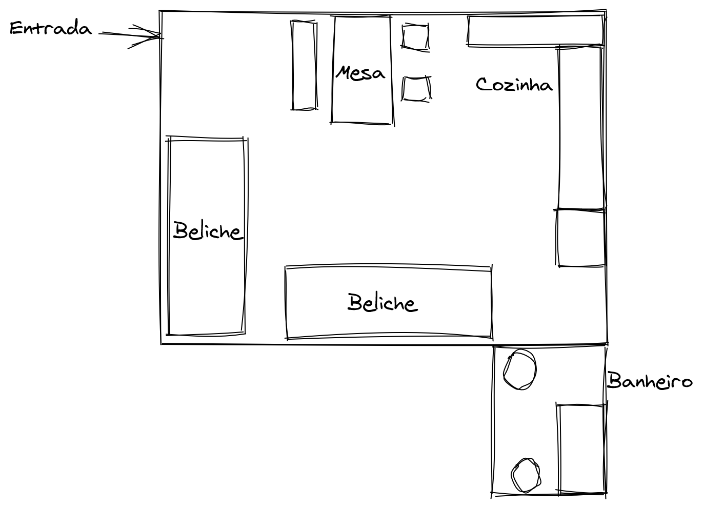

Fala pessoal, tudo em cima?

No post anterior eu fiz um geral sobre como foi minha chegada, impressões do curso e meu processo de estudos da língua inglêsa.

Hoje, vou contar pra vocês como foi a saga de encontrar um lugar pra morar em um país que passa por uma crise imobiliária bem severa.

---

## Acomodação

Como comentei anteriormente, a agência que me levou para o intercâmbio também oferecia uma casa temporária para os alunos morarem até encontrar outro local.

Como meu orçamento não estava tão bom e o aluguel desse tipo de casa geralmente tem um valor acima da média por conta dos serviços que são oferecidos, eu peguei apenas duas semanas de acomodação.

No dia seguinte a minha chegada na casa, ainda deitado na cama, o Raul que habita dentro de mim mandou o recado:

> "Você não vai se divertir, sair, aproveitar nada enquanto você não arrumar outro lugar pra ficar. Essa é a prioridade número um e você só vai pensar nisso."

E bem, foi assim que eu lidei com esse processo do começo ao fim, afinal, meu prazo era de apenas 2 semanas.

Tentei conversar com o pessoal da agência para ver qual a possibilidade de estender essas duas semanas e bem, foram bem diretos:

> "Bem baixa, pois temos outros estudantes chegando no dia seguinte a saída de alguém".

Ao ouvir isso, olhei pra dentro e o Raul interno me olhava com aquelas caras de quem diz: "Eu disse pra você, agora corre".

## Estratégia

Para resolver esse problema, eu defini algumas estratégias que foram essenciais no resultado final

### Ter onde buscar

Ao contrário do Brasil (pelo menos no Estado de SP), onde entramos em contato com imobiliária e sinalizamos um apartamento/casa para morar, na Irlanda, como estudante, as coisas funcionam um pouco diferentes.

Você não tem dinheiro pra alugar uma casa e, mesmo que o tivesse, para a imobiliária, alugar algo para você é assumir um risco muito alto de você ir embora sem falar nada e ela ficar no prejuízo.

Poderia também alugar direto com o dono, que tem um nome chique de "Land lord" (senhor da terra) ou "Land lady" (senhora da terra). Mas também, encontrar essas pessoas era sempre mais difícil.

Logo, o que restou foi ir atrás de pessoas que moram em casas já alugadas e estava com uma cama sobrando na casa ou algo do tipo.

Desde antes de ir de fato para Dublin, eu já fazia parte de alguns grupos de brasileiros no Facebook. O que eu fiz foi ao invés de estar apenas nos principais, entrar em TODOS os grupos, tanto de brasileiro quanto de gringos e ativar as notificações de todos eles para ser em tempo real, ou seja, se alguém postar algo, independente do que, pinga uma notificação.

No começo foi bem chato, porque eu ficava toda hora recebendo notificação de coisas aleatórias, mas também via bastante anúncio de quartos. A questão era só chegar primeiro.

### Rotina

Todos os dias, eu acordava, tomava meu café da manhã, ligava meu notebook, abria o Facebook, ficava algumas horas ali vendo as notificações da noite anterior, mandando mensagem para as pessoas e vendo novos posts.

Programa um pouco, assistia uns videos, almoçava e voltava pro computador pra ver se algo aparecia.

### Foco

Como já estava no modo sobrevivência, eu só conseguia pensar nisso.

Não sai no final de semana, não fui das festas e em bares quando as pessoas chamavam. Todo meu esforço estava concentrado em uma missão: "Arrumar um local pra ficar".

Óbvio que essas pessoas que saiam para baladas e já estavam vivendo o intercâmbio, no fim, também conseguiram casa. Porém, essas situações na minha cabeça a maneira de enxergar o mundo tem um outro peso. Eu sempre fui assim e provavelmente sempre serei.

### Paciência

Depois de toda a estratégia "militar" montada, agora era questão de paciência e fazer o que precisava ser feito.

Em 3 dias eu finalmente consegui uma resposta de um rapaz que estava passando a vaga dele em um apê perto do centro da cidade.

## Primeira visita

No dia seguinte à troca de mensagem, subi no ônibus e me dirigi para o apartamento do rapaz.

O fato de não conhecer a cidade, as dinâmicas sociais, onde estava, ir visitar a casa de pessoas estranhas me deixavam bem apreensivo. Mas precisava ser feito.

Chegando lá, mandei mensagem pro sujeito, que demorou uns 15 minutos pra me responder de volta, me fazendo pensar que talvez tivesse sido um grande trouxa.

Ao me receber, nos apresentamos e fomos entrando em direção ao apartamento.

Era um prédio bem estranho. Quanto mais você entrava no prédio e andava no corredor central, mais portas haviam, como se cada porta dividisse o prédio em pequenos blocos.

Eis que chegamos e no apartamento e... meu deus.

Sabe nos desenhos antigos, tipo pica-pau, quando tinha um grupo de pessoas fumando no mesmo local e para aguém sair, uma porta era aberta?

<!-- TODO: Gif aqui -->

Era tipo isso...

Na sala, estavam 5 brasileiros onde, 1 se encontrava deitado possivelmente dormindo, 3 nos sofas do lado e 1 sentado na cadeira ao lado de uma mesa redonda bem velha.

No centro da sala, uma mesa cheia de tabaco para fazer o próprio cigarro (bem comum aqui fora), seda, maconha, um cinzeiro cheio de cigarros apagados e latas de energético e cerveja. O típico cenário pós-festa.... ou seria assim normalmente?

Para além do meu preconceito com o ambiente, todo mundo me cumprimentou e o "líder" da casa pediu para o rapaz terminar de me mostrar a casa e em seguida retornasse à sala.

A cozinha, apesar de organizada, era um verdadeiro caos. Todos os armários enferrujados, fogão de duas bocas, um microondas que parecia não funcionar.

O quarto que eu ficaria era bem... isso. 3 camas de solteiro, umas malas do lado e um guarda-roupe grande.

Apenas um banheiro na casa que parecia um pouco mofado, mas em linhas gerais, organizado.

Ao retornar a sala, o "lider" pediu para que me sentasse, me ofereceu água e começou seu questionário.

Caso você não saiba, é preciso passar por entrevistas para alugar casa, onde os moradores, donos ou agente imobiliario irão avaliar os candidatos e aceitar quem eles veem com mais potencial de sucesso, dado a situação como um todo.

Enfim, me perguntou da onde eu era no Brasil, há quanto tempo estava na Irlanda, se estava gostando, primeiras impressões da cidade e o que eu tinha achado da casa.

Apesar deu ter detestado, eu realmente precisava de um local para ficar. Então, consegue imaginar que tentei dar uma escondida no que realmente tinha achado da casa e tentei dar a entender de que estava ok.

Ele então continuou, me explicou quais eram as regras da casa e pra minha surpresa, haviam várias.

1. Toda semana, duas pessoas eram responsáveis pela limpeza da casa, como uma escala. Precisava limpar os banheiros, tirar o lixo, arrumar a cozinha e quartos
1. A sala era um ambiente comum para todos e pelo fato da casa não ter varanda e sair do prédio era uma jornada, era permitido fumar somente na sala e com a porta fechada;
1. pelo menos uma vez por semana eles davam uma festa no apartamento podendo ter pessoas de fora da casa;
1. as comidas eram separadas, porém, havia um fundo da casa para comprar produtos de limpeza, papel higiênico e coisas comuns;
1. eventualmente alguém levava outra pessoa pra transar na casa e como a sala era o único lugar, nesses dias a cozinha deveria ser evitada ao máximo.

Em dado momento eu meio que desliguei e parei de ouvir o que ele estava falando. Sabe em filme quando você o personagem começa a ouvir a pessoa que está falando lá no fundo e se perde pensando em outras coisas? Foi tipo isso.

No fim, voltei e ele me perguntou o que eu tinha achado.

Falei que tinha gostado pelo fato de ter bastante regras, afinal, deixava as coisas uma terra sem lei onde todo mundo faz o que da na telha e que tinha já pensado como me adaptaria ali, utilizando a mesa da sala pra estudar e fazer minhas coisas e talz.

No fim, tanto quanto ele sabiam que eu e a casa não tinham nada a ver, mas eu quis deixar essa porta aberta, mesmo que fosse pra depois procurar outro lugar.

Ele me disse que teria mais algumas visitas no mesmo dia e que até na manhã do dia seguinte pediria para o rapaz que anunciou a vaga mandar mensagem me falando se tinha rolado ou não.

Na volta pra casa, ainda no ônibus, encostei a cabeça no vidro tentando digerir o que exatamente tinha acontecido, o que eu faria verdadeiramente se fosse morar naquela casa. Como eu poderia estudar com a galera fumando e fazendo festa?

A real é que a minha busca estava ainda longe de acabar.

Na manhã seguinte o rapaz havia me mandado mensagem falando que eles encontraram uma pessoa que se encaixa bem no perfil da casa.

De volta à busca.

## Sorte grande

> Apenas mais uma semana garantida de moradia.

Esse foi pensamento bem dificil para uma pessoa que tem certo grau de ansiedade lidar.

Já havia passado 2 dias da então visita esquisita que havia feito e até agora... nada de outra visita dar certo.

Sempre que mandava mensagem, ou era ignorado, ou recebia uma mensagem falando que a vaga havia sido preenchida.

> "Como preenchida? Você postou e eu fui o terceiro a mandar mensagem..."

Pois é. Na busca por moradias, não havia espaço para segundo ou terceiro a mandar mensagem.

E foi então, que ainda naquele dia, tocou uma notificação no Facebook que dizia:

> "3 vagas disponíveis..."

O resto da mensagem, pouco importava. Eu respondi o post e mandei mensagem privada na hora pra menina falando:

> "Eu quero as 3."

Foi uma decisão um pouco esquisita, mas eu rapidamentamente pensei que:

1. Se ela ofereceu 3 vagas, provavelmente quer se desfazer das 3 o mais rápido possível;
2. Todo mundo na moradia estava na mesma situação que eu, ou seja, conseguir mais duas pessoas seria o menor dos problemas.

Dois minutos depois ela me responde:

> "Oi, você quer mesmo as 3 vagas?"

E eu só pude responder:

> "Sim, pra mim e mais duas pessoas que estão morando comigo."

No fim eu ainda não sabia quem, mas o fato é que haveriam mais duas pessoas sem dúvidas.

Ela me respondeu com um:

> "O endereço é X. Você pode vir amanhã as 10 da manhã?"

É claro que poderia. Se fosse pra estar lá em 1 hora eu iria.

Mandei mensagem confirmando e agora eu precisava convidar duas pessoas pra ir comigo.

Desde o dia que havia chego na casa, dois caras que já se conheciam lá do Brasil e estavam fazendo "intercâmbio juntos" me ajudaram bastante. Foram eles que me passaram as dicas iniciais, afinal, eles chegaram 1 semana antes.

E também, eram duas pessoas extratemante amigáveis e engraçadas.

Olhei para o restante da casa e não poderia ser outra escolha. Fiz o convite e os dois ficaram empolgadassos e concordaram no mesmo momento.

Bom, agora era só manter a calma e ir.

## Segunda visita

No dia seguinte, acordamos bem cedo, tomamos café e partimos para a entrevista da casa.

Ao olhar no mapa a localização, pude notar que não era tão longe do centro (onde ficam a maioria das escolas) e também era ao lado de um dos maiores parques da Irlanda, o Phoenix Park.

<!-- TODO: Add phoenix park image -->

Ainda me sentia confiante em que ia dar certo de pegar as 3 camas na casa.

Ao chegar no local, fomos recebidos pela anunciante das vagas.

Diferente do apartamento que havia ido na semana anterior, esse studio era bem... direto ao ponto.

Um quadrado de uns 15x15 onde ficavam duas beliches, uma mesa "de jantar", cozinha, alguns armários improvisados e uma porta que dava para um banheiro bem pequeno, mais ou menos assim:

A primeira coisa que me veio a cabeça e eu tive que perguntar era:

> "Por que você está saíndo da casa?"

Ela me disse que ela e o namorado moravam ali e como dava pra ver, eles não tinham privacidade nenhuma, afinal, era o casal e mais dois homens.

Então perguntei:

> "E os outros dois?"

Ela respondeu que ao anunciar a saída dela e do namorado, um dos rapazes também anunciou que estava de mudança, e por isso as 3 vagas no mesmo tempo.

Eu havia entendido a situação, mas alguns segundos depois eu pensei:

> Bom... se eram 4 pessoas e 3 estão saindo, isso significa que a gente vai morar com 1 pessoa totalmente aleatória.

Esse pensamento perturbou todo sentimento bom que eu havia sentido até ali. O que me levou a perguntar:

> "E sobre esse cara que vai morar com a gente? O que nme diz?"

Então ela disse que era um brasileiro chefe em um restaurante que estava na Irlanda há alguns anos já e que quase não ficava em casa, chegando de madrugada apenas para dormir e saia logo ao acordar.

Disse também que ele estava falando de uma possível mudança há tempos, mas nada concreto.

Isso me levantou uma bandeira vermelha na cabeça.

> Como que eu vou ficar tranquilo morando com uma pessoa que eu não sei nem o rosto? E se ele for um mal carater? E se ele roubar meu dinheiro?

Quando a gente está nos grupos do Facebook da Irlanda, a gente lê muita história que olha... daria uma boa ficção.

O problema era que não dava tempo pra negar. Eu tinha só mais 3 dias de moradia garantia e os caras que foram comigo mais 2.

Vesti a minha máscara de pessoa ultra bem comunicativa e sociável e conversei com ela, explicando que tinhamos interesse pra mudar o quanto antes.

Ela pareceu empolgada. Disse que ia conversar com o namorado e outro rapaz e que me avisaria por mensagem.

No dia seguinte, acordo com uma mensagem:

> "Hey, combinado. Me encontra no centro com o valor do deposíto dos 3 (750 euros, 250 pra cada cama) que eu te levo as chaves."

Aqui vale uma observação. Caso você não saiba, um **deposíto** nada mais é do que um "dinheiro calção", um dinheiro extra no valor de 1 ou mais aluguéis que você da pra pessoa como garantia de que se você quebrar algo, for embora do país sem avisar, ela vai ter uma segurança para conseguir encontrar outra pessoa ou consertar de algo. Lembrando que você resgata esse dinheiro ao sair do imóvel.

Como na Irlanda, em muitas das vezes, fazemos negócios com os moradores, não com os donos das casas, você da o deposíto pra pessoa que está alugando o quarto/cama e ela vai embora. Quando você for sair da casa, a pessoa no qual está alugando te da o depósito, ficando em uma roda infinita.

Enfim, conseguir o studio foi como tirar uma tonelada das costas. Já não aguentava aquela ideia de ter que pagar um hotel ou algo parecido.

Conversei com os meus colegas de quarto e eles também vibraram.

Como havia chance de abrir mais uma vaga, fui logo tentando pensar em mais uma pessoa ali do casa para (possivelmente) levar conosco.

Alguns dias depois da minha chegada na Ilha, a casa recebeu um cara bem peculiar. Artista, com um jeito simpático e um bigodão. Achei que dentre todas as opções, talvez fosse uma boa pessoa a convidar para dividir a casa.

Perguntei se ele tinha interesse, caso a vaga abrisse mesmo, ele disse que 100% garantido que sim, era só mandar mensagem.

Fui ao centro, com 750 euros em dinheiro vivo (pensa num cagaço de ser roubado ou perder) e peguei as chaves do ap. Agora finalmente poderíamos nos mudar e ficar com paz no coração.

### Mudança e primeira noite

No mesmo dia, procurei nos grupos brasileiros o número de alguém que pudesse fazer a nossa mudança por um preço camarada. Mandei mensagem para alguns e encontramos um rapaz que tinha um carro SUV e faria nossa mudança por 40 euros no mesmo dia.

Corremos para fazer nossa mala, nos despedimos das pessoas e no horário combinado, o rapaz foi nos buscar.

Ao chegarmos na nova casa, o outro morado não estava e quase tudo estava vazio.

Comecei a olhar ao redor, nos armários e comecei a reparar que a casa estava bem... suja.

Conversei com os meus roommates (companheiros de quarto) que no dia seguinte, faríamos uma faxina.

### Problemas com o morador

Primeira noite na casa. Malas por desfazer, cansaço físico mas aliviado emocionalmente.

Já de banho tomado e deitado em minha cama, apesar de estar leve, sempre me vinha o mesmo pensamento:

> e esse outro cara, hein?

Caí no sono.

Por volta de umas 2 ou 3 da manhã, já no meu sono profundo, ouço alguém abrindo. Logo acordo, sem entender o que está acontecendo e aos poucos vou retomando a minha consciência: "O cara, é claro".

Fazendo todo o barulho possível, o bom rapaz decidiu comer algo.

Enquanto ele preparava sua comida, eu conseguia apenas pensar:

> que inferno... sério mesmo que vai ser todo dia isso?

Assim que ele deitou na cama, fiquei mais tranquilo e comecei a voltar a dormir. Estava tudo indo muito bem até que... o diabo começa a roncar.

Não era apenas um ronquinho qualquer, ela uma moto-serra bem em baixo de mim.

Fiquei uns 15 minutos rolando na cama sem conseguir voltar a dormir até que eu me rendo, inverto a minha posição na cama para tirar meu ouvido do ronco dele, coloco meu fone de ouvido, um podcast específico para insônia e volto a dormir.

No dia seguinte, começamos a levantar para comer, nos arrumarmos para ir pra escola e talz até que ele acorda de um sono muito profundo.

Fizemos as devidas apresentações, perguntei um pouco sobre ele, a vida dele na Irlanda, até que ele tocou no ponto de que estaria se mudando dali uma semana mais ou menos e perguntou se a gente queria trazer alguém ou ele precisava anunciar.

Foi difícil esconder minha alegria (de novo).

Falei que a gente já tinha uma pessoa em mente e que poderia deixar com a gente. Ele parecia até mais aliviado. Até disse que não dormiria nem casa mais (meu sono agradeceu).

Enfim, mandei mensagem para o rapaz da casa no qual havia deixado já avisado e ele aceitou morar com a gente.

Agora era só questão de tempo.

Peguei o número de celular dele para facilitar a comunicação, peguei minhas coisas e fui pra aula.

### Semanas seguintes e a dinâmica da casa

Na segunda noite, reparamos que o dito cujo não voltou pra casa. Será que morreu? pensei.

Tudo bem, seguimos nossas vidas.

Depois de olhar o studio com mais calma e energia, eu e meus amigos começamos e encontrar umas coisas bem tensas, como muita poeira de baixo da cama junto com caixas de pizza, como se aquilo nunca tivesse sido limpo na vida.

Na hora sentimos um certo nojo e decidimos que iríamos limpar aquele studio de cabo a rabo.

Já que o rapaz não dormiria mais em casa, separamos as coisas dele (as que ele não levou) em uma sacola começamos a colocar a casa de cabeça pra baixo.

Limpamos os armários, jogamos um monte de coisa velha e vencida fora, deixamos algumas coisas que estavam boas ainda. Foi limpando tudo, que eu comecei a entender o possível motivo da menina o namorado e o outro rapaz ter saído da casa.

Tudo dava a entender que os hábitos de higiene do sujeito que ficou eram BEM questionáveis.

---

Ficamos a semana inteira esperando ele buscar suas coisas em casa e trazer a chave.

Todos os dias eu mandava mensagem perguntando quando ele vinha e a resposta era sempre: "quando der eu apareço". O que me incomodava demais.

Eu sou um tanto quanto sistemático, gosto das coisas certas e alinhadas. Já o rapaz, o total oposto.

Por fim, o nosso novo colega de quarto se mudou para o studio.

No dia seguinte, mandei mensagem falando pra ele me passar o endereço do trabalho dele que eu levaria o depósito e pegaria (finalmente) a chave dele.

Chegando lá, o cumprimentei e fizemos as trocas. Perguntei quando ele ia buscar o restante das coisas e a resposta foi um grande... "Não sei ainda...quando tiver um tempinho sobrando".

Poxa, sério? Voltando pra casa eu até cheguei a cogitar se ele tinha me dado a chave certa ou se tinha feito uma cópia dela (ainda estava noiado).

Na semana seguinte, mandei uma mensagem falando: "to deixando a sacola com as suas coisas em cima da máquina de lavar na área comum, se quiser vir buscar, estará ali".

E ele foi... rasgou o saco em que seus pertences se encontravam, pegou só o que queria e deixou o resto lá, jogado 😑. O verdadeiro exemplo de ser humano, só que o contrário.

Por fim, o quarteto estava montado.

Como boa sociedade, tratamos de definir regras de boa convivência:

- Depois das 00:00, todas luzes apagadas e sem barulho nenhum;
- Cada final de semana, uma dupla fica responsável pela limpeza, um a área comum e outro o banheiro;
- Comidas são individuais a menos que esteja acordado entre todo mundo que tal coisa pode ser usado por todos da casa;
- Sem festas e trazer gente aqui. O studio não dava conta nem da gente, quem dirá de mais pessoas.
- Fones de ouvido para ver videos, música, etc.
- Se chegar de madrugada, tentar fazer o menos barulho possível.

Todos concordaram e seguimos morando juntos por mais alguns meses.

Foi uma experiência bem divertida e que me ensinou muita coisa, afinal, era a primeira vez que eu morava com pessoas não eram minha mãe e irmã.

Saímos algumas vezes juntos, trocamos muita ideia e nos conhecemos bastante.

Rolou apoio um do outro em métodos de estudo, troca de figurinhas sobre a vida e até aprendi algumas coisas o artista (o último integrante) sobre desenho e o pensamento artístico.

Viniboy, Tauã e Seu Madruga (Victor), obrigado pelo tempo que passamos juntos e pelos aprendizados. Com certeza me tornei uma pessoa bem melhor e espero ter contribuído pra vida e crescimento de vocês também! ;)

## Outros caminhos

Depois de uns 3 meses morando com eles, a minha namorada, Camila, também havia planejado o intercâmbio para Dublin, finalmente havia chegado.

Nunca paramos de conversar nesse período e tinhamos decido que não iriamos morar juntos até então.

A razão disso? Conforto. Eu já tinha meu canto, a dinâmica bem estabelecida, já estava "tudo certo". Mexer nisso seria arrumar novos problemas.

Mas a real é que depois de 1 mês e nos vendo apenas alguns dias na semana, eu questionei aquele conforto todo que queria e disse pra ela:

> "Ou, procura um quarto de casal ai pra gente. Vamos morar juntos."

A Camila sempre foi uma pessoa prática.

Ela chegou, arrumou casa na primeira semana e um emprego com 3. Diferentemente de mim, que sofre em cada decisão grande que me tira do centro do meu conforto (mesmo caminhando pra resolver), ela vê as coisas de uma maneira mais objetiva e sempre ataca direto o problema. Em suas palavras "tem que resolver, tem que resolver".

Procurar um quarto de casal foi um processo bem chato. Eles geralmente são um pouco mais caros e tem casas que não aceitam casais por algúm motivo. Mas pelo fato de ambos já terem um dinheiro, emprego e um local para morar, ela foi procurando com calma e me mandando os que iriamos visitar.

No fim, ela encontrou um quarto no centro da cidade por 700 euros mensais (350 pra cada). Era um apartamento de 2 comodos, sala e cozinha. Nele, morava 1 casal de brasileiros (que anunciou a vaga) no maior quarto da casa, uma familia da Mongolia (um casal, uma criança e mãe do homem) e o outro quarto menor que era pra gente.

A ideia pareceu um pouco maluca, afinal, seriam 8 pessoas em um apartamento, mas pelo valor e localização, parecia um bom negócio. E foi, apesar de alguns momentos de falta de comunicação entre nós brasileiros e a familia.

Nos mudamos e foi lá que fiquei até o fim do intercâmbio.

O bom de morar no centro é que você está perto de tudo que precisa. A minha escola ficava a 10 minutos de caminhada, minha academia a 7 e o trabalho a uns 15. Além de estar a 2 minutos a principal rua de bares de Dublin, o temple bar.

Tanto o momento de ida e volta para escola e para o trabalho, eram momentos que me traziam uma certa paz. Eu andava, escutando meus podcasts preferidos, observando as pessoas, a sociedade, a dinâmica social.

Apesar de tudo, também aprendi bastante, principalmente a como morar com pessoas que possuem uma cultura totalmente diferente da sua.

Mais uma vez, eu vi o quanto eu estava certo em pensar que além do inglês, a grande lição do intercâmbio seria para me evoluir como pessoa e abrir ainda mais a minha cabeça para entender que o mundo, é muito maior e mais complexo do que ele parece quando ficamos no mesmo lugar a nossa vida inteira.
